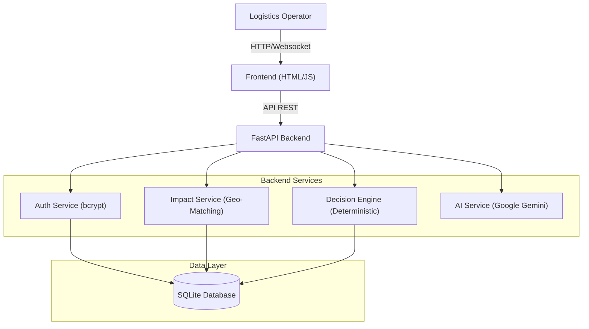

# LogiTech - SupplyChain Sentinel

**SupplyChain Sentinel** is an AI-powered logistics platform that detects supply chain disruptions (port strikes, weather, closures) and automatically generates actionable response tickets.

## 🏗️ Architecture



## 🚀 Features

- **Real-time Disruption Monitoring** - Track active supply chain disruptions
- **AI-Powered Impact Analysis** - Intelligent analysis of affected shipments
- **Automated Action Tickets** - Generate detailed response tickets
- **Database Persistence** - SQLite with SQLAlchemy ORM
- **Secure Authentication** - Password hashing with bcrypt
- **Multi-user Support** - Role-based access (Manager, Operator, Analyst)
- **Beautiful UI** - Modern, responsive design with real-time updates

## 💻 How to Run (Simple)

### Step 1: Install
Open your terminal inside the `backend` folder and run:
```bash
pip install -r requirements.txt
```

### Step 2: Run
Start the server with this command:
```bash
python run.py
```
*(If that doesn't work, try `python -m uvicorn main:app --reload --host 127.0.0.1 --port 8000`)*

### Step 3: Open
Go to your browser and visit:
👉 **[http://localhost:8000](http://localhost:8000)**

That's it! Log in using the credentials below.


---

## 📖 About the Project

### ❓ Problem Statement
Global supply chains are increasingly fragile. Disruptions like the **Red Sea Crisis**, **Port Strikes**, or **Severe Weather** can delay shipments by weeks and cost millions in demurrage and expedited shipping.
Currently, logistics operators manually monitor news, cross-reference it with thousands of shipments, and manually email carriers. This process is **slow, error-prone, and reactive**.

### 💡 Motivation
The motivation behind **SupplyChain Sentinel** was to transform logistics from *reactive* to *proactive*. We wanted to build a "Digital Watchtower" that doesn't just show you where ships are, but **tells you what to do** when things go wrong.

### 🛠️ Our Solution
We built an **AI-Assisted Disruption Response System** that:
1.  **Ingests Disruption Data:** Simulates real-time feeds of global events.
2.  **Analyzes Impact:** Uses geospatial logic to instantly identify which shipments are in the affected zone.
3.  **Generates Solutions:** A deterministic engine calculates the best rerouting options (cost vs. time).
4.  **Assists Operators:** Uses **Google Gemini AI** to explain the situation in natural language and draft response tickets.

### 📉 Impact
-   **Response Time:** Reduced from hours to **seconds**.
-   **Accuracy:** Eliminates human error in identifying affected container IDs.
-   **Cost Savings:** Early intervention allows rerouting before expensive bottlenecks form.

---

## 🚀 Future Expansion
-   **Live Data Integration:** Connect to MarineTraffic/VesselFinder APIs for real-time ship positioning.
-   **Predictive Analytics:** Use ML to predict disruptions (e.g., hurricane paths) *before* they happen.
-   **Blockchain Ledger:** Record all action tickets on a blockchain for immutable audit trails.
-   **Automated Execution:** API integrations with carriers (Maersk, MSC) to book new slots automatically.

---

## 👥 Demo Accounts

| Operator ID | Password | Role | Name |
|------------|----------|------|------|
| OP-001 | manager123 | Manager | Sarah Chen |
| OP-002 | operator123 | Operator | Marcus Rodriguez |
| OP-003 | analyst123 | Analyst | Aisha Patel |
| OP-004 | operator123 | Operator | James Wilson |
| OP-005 | manager123 | Manager | Li Wei |

## 🔧 Configuration

### Enable AI Assistant (Optional)

1. Get a free API key from [Google AI Studio](https://aistudio.google.com/app/apikey)
2. Create `backend/.env`:
   ```
   GEMINI_API_KEY=your_api_key_here
   ```
3. Restart backend:
   ```bash
   docker compose restart backend
   ```

## 📁 Project Structure

```
LogiTech/
├── backend/              # FastAPI backend
│   ├── services/        # Business logic services
│   ├── db_models.py     # SQLAlchemy models
│   ├── database.py      # Database configuration
│   ├── init_db.py       # Database initialization
│   ├── main.py          # FastAPI application
│   └── requirements.txt # Python dependencies
├── frontend/            # Web frontend
│   ├── dashboard.html   # Main dashboard
│   ├── login.html       # Login page
│   ├── signup.html      # Registration page
│   ├── app.js           # Main application logic
│   └── styles.css       # Styling
└── docker-compose.yml   # Docker configuration
```

## 🗄️ Database

- **Type**: SQLite
- **ORM**: SQLAlchemy
- **Location**: `backend/data/logitech.db`
- **Persistence**: Docker volume (`backend-data`)

### Database Models

- **OperatorDB** - User accounts with password hashing
- **DisruptionDB** - Supply chain disruptions
- **ActionTicketDB** - Response action tickets
- **SessionDB** - User sessions
- **ConversationDB** - AI conversation history

## 🔐 Security Features

- ✅ Password hashing with bcrypt
- ✅ Session-based authentication
- ✅ Environment variable protection
- ✅ CORS configuration
- ✅ SQL injection prevention (SQLAlchemy ORM)

## 📊 Sample Data

The system comes pre-loaded with:
- 5 demo operator accounts
- 5 sample disruptions:
  - Port Strike (Chennai Port)
  - Weather Delay (Pacific Shipping Lane)
  - Route Closure (Suez Canal)
  - Equipment Failure (Singapore Hub)
  - Customs Delay (Rotterdam Port)

## 🧪 Testing

### Test Workflow

1. Login with demo account (OP-001 / manager123)
2. Click on a disruption (e.g., "Chennai Port")
3. Chat with AI: "Analyze impact"
4. Generate action tickets
5. Approve/manage tickets
6. Test filters and export

### Test Features

- ✅ User authentication
- ✅ Disruption monitoring
- ✅ AI assistant (requires API key)
- ✅ Ticket generation
- ✅ Ticket management
- ✅ Notifications
- ✅ Data persistence

## 🐳 Docker Commands

```bash
# Start application
docker compose up -d

# Stop application
docker compose down

# Restart services
docker compose restart

# View logs
docker compose logs -f

# Rebuild containers
docker compose build --no-cache
```

## 🌐 API Endpoints

- `POST /api/auth/register` - Register new operator
- `POST /api/auth/login` - Login
- `POST /api/auth/logout` - Logout
- `GET /api/auth/verify` - Verify session
- `GET /api/disruptions` - Get all disruptions
- `GET /api/tickets` - Get all tickets
- `POST /api/tickets` - Create ticket
- `PUT /api/tickets/{id}` - Update ticket

## 📝 License

This project is for educational and demonstration purposes.

## 👨‍💻 Author

Created as a demonstration of modern web application development with:
- FastAPI (Python)
- SQLAlchemy ORM
- Docker containerization
- Real-time UI updates
- AI integration capabilities

## 🆘 Support

For issues or questions, please open an issue on GitHub.

---

**Built with ❤️ for logistics professionals**
