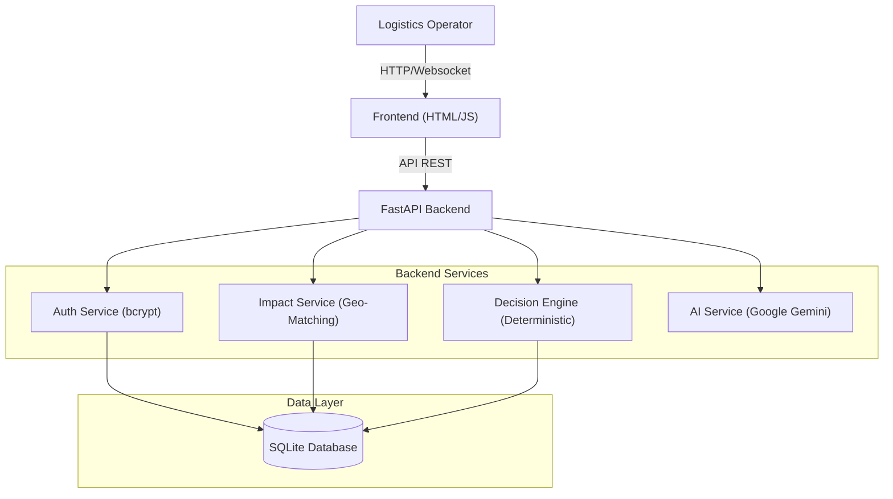

# LogiTech - SupplyChain Sentinel

**SupplyChain Sentinel** is an AI-powered logistics platform that detects supply chain disruptions (port strikes, weather, closures) and automatically generates actionable response tickets.

## 🏗️ Architecture



## 🚀 Features

- **Real-time Disruption Monitoring** - Track active supply chain disruptions
- **AI-Powered Impact Analysis** - Intelligent analysis of affected shipments
- **Automated Action Tickets** - Generate detailed response tickets
- **Database Persistence** - SQLite with SQLAlchemy ORM
- **Secure Authentication** - Password hashing with bcrypt
- **Multi-user Support** - Role-based access (Manager, Operator, Analyst)
- **Beautiful UI** - Modern, responsive design with real-time updates

## 📋 Prerequisites

- Docker & Docker Compose
- Git

## 🛠️ Quick Start

### Option 1: Docker (Recommended)

1.  **Clone the Repository**
    ```bash
    git clone https://github.com/Sreeshanthreddy73/Taskify.git
    cd Taskify
    ```

2.  **Start Application**
    ```bash
    docker compose up --build
    ```

3.  **Access Dashboard**
    Open your browser and go to:
    👉 **[http://localhost:8000](http://localhost:8000)**

### Option 2: Local Setup (Python)

1.  **Install Dependencies**
    ```bash
    cd backend
    pip install -r requirements.txt
    ```

2.  **Initialize Database**
    ```bash
    python init_db.py
    ```

3.  **Run Server**
    ```bash
    python -m uvicorn main:app --reload --host 127.0.0.1 --port 8000
    ```
4.  **Access Dashboard**
    Go to **[http://localhost:8000](http://localhost:8000)**

## 👥 Demo Accounts

| Operator ID | Password | Role | Name |
|------------|----------|------|------|
| OP-001 | manager123 | Manager | Sarah Chen |
| OP-002 | operator123 | Operator | Marcus Rodriguez |
| OP-003 | analyst123 | Analyst | Aisha Patel |
| OP-004 | operator123 | Operator | James Wilson |
| OP-005 | manager123 | Manager | Li Wei |

## 🔧 Configuration

### Enable AI Assistant (Optional)

1. Get a free API key from [Google AI Studio](https://aistudio.google.com/app/apikey)
2. Create `backend/.env`:
   ```
   GEMINI_API_KEY=your_api_key_here
   ```
3. Restart backend:
   ```bash
   docker compose restart backend
   ```

## 📁 Project Structure

```
LogiTech/
├── backend/              # FastAPI backend
│   ├── services/        # Business logic services
│   ├── db_models.py     # SQLAlchemy models
│   ├── database.py      # Database configuration
│   ├── init_db.py       # Database initialization
│   ├── main.py          # FastAPI application
│   └── requirements.txt # Python dependencies
├── frontend/            # Web frontend
│   ├── dashboard.html   # Main dashboard
│   ├── login.html       # Login page
│   ├── signup.html      # Registration page
│   ├── app.js           # Main application logic
│   └── styles.css       # Styling
└── docker-compose.yml   # Docker configuration
```

## 🗄️ Database

- **Type**: SQLite
- **ORM**: SQLAlchemy
- **Location**: `backend/data/logitech.db`
- **Persistence**: Docker volume (`backend-data`)

### Database Models

- **OperatorDB** - User accounts with password hashing
- **DisruptionDB** - Supply chain disruptions
- **ActionTicketDB** - Response action tickets
- **SessionDB** - User sessions
- **ConversationDB** - AI conversation history

## 🔐 Security Features

- ✅ Password hashing with bcrypt
- ✅ Session-based authentication
- ✅ Environment variable protection
- ✅ CORS configuration
- ✅ SQL injection prevention (SQLAlchemy ORM)

## 📊 Sample Data

The system comes pre-loaded with:
- 5 demo operator accounts
- 5 sample disruptions:
  - Port Strike (Chennai Port)
  - Weather Delay (Pacific Shipping Lane)
  - Route Closure (Suez Canal)
  - Equipment Failure (Singapore Hub)
  - Customs Delay (Rotterdam Port)

## 🧪 Testing

### Test Workflow

1. Login with demo account (OP-001 / manager123)
2. Click on a disruption (e.g., "Chennai Port")
3. Chat with AI: "Analyze impact"
4. Generate action tickets
5. Approve/manage tickets
6. Test filters and export

### Test Features

- ✅ User authentication
- ✅ Disruption monitoring
- ✅ AI assistant (requires API key)
- ✅ Ticket generation
- ✅ Ticket management
- ✅ Notifications
- ✅ Data persistence

## 🐳 Docker Commands

```bash
# Start application
docker compose up -d

# Stop application
docker compose down

# Restart services
docker compose restart

# View logs
docker compose logs -f

# Rebuild containers
docker compose build --no-cache
```

## 🌐 API Endpoints

- `POST /api/auth/register` - Register new operator
- `POST /api/auth/login` - Login
- `POST /api/auth/logout` - Logout
- `GET /api/auth/verify` - Verify session
- `GET /api/disruptions` - Get all disruptions
- `GET /api/tickets` - Get all tickets
- `POST /api/tickets` - Create ticket
- `PUT /api/tickets/{id}` - Update ticket

## 📝 License

This project is for educational and demonstration purposes.

## 👨‍💻 Author

Created as a demonstration of modern web application development with:
- FastAPI (Python)
- SQLAlchemy ORM
- Docker containerization
- Real-time UI updates
- AI integration capabilities

## 🆘 Support

For issues or questions, please open an issue on GitHub.

---

**Built with ❤️ for logistics professionals**
