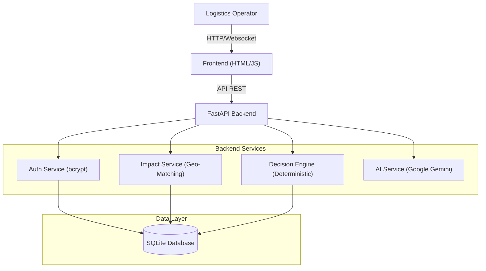

# LogiTech - SupplyChain Sentinel

**SupplyChain Sentinel** is an AI-powered logistics platform that detects supply chain disruptions (port strikes, weather, closures) and automatically generates actionable response tickets.

## 🏗️ Architecture



## 🚀 Features

- **Real-time Disruption Monitoring** - Track active supply chain disruptions
- **AI-Powered Impact Analysis** - Intelligent analysis of affected shipments
- **Automated Action Tickets** - Generate detailed response tickets
- **Database Persistence** - SQLite with SQLAlchemy ORM
- **Secure Authentication** - Password hashing with bcrypt
- **Multi-user Support** - Role-based access (Manager, Operator, Analyst)
- **Beautiful UI** - Modern, responsive design with real-time updates

## 💻 How to Run (Simple)

### Step 1: Install
Open your terminal inside the `backend` folder and run:
```bash
pip install -r requirements.txt
```

### Step 2: Run
Start the server with this command:
```bash
python run.py
```
*(If that doesn't work, try `python -m uvicorn main:app --reload --host 127.0.0.1 --port 8000`)*

### Step 3: Open
Go to your browser and visit:
👉 **[http://localhost:8000](http://localhost:8000)**

That's it! Log in using the credentials below.


---


---

## 📖 About the Project: SupplyChain Sentinel

### ❓ Problem Statement: The Logistics "Black Box"
Global supply chains are notoriously fragile and opaque. In 2024 alone, supply chain disruptions cost the global economy over **$2 Trillion**.
*   **The Workflow Gap:** Logistics managers currently rely on manual methods—monitoring news feeds, manually cross-referencing spreadsheet manifests, and emailing carriers one by one.
*   **The Cost of Delay:** A 4-hour delay in rerouting a vessel can result in missing a berthing window, leading to **weeks of delay** and millons in demurrage charges.
*   **Data Overload:** Operators are overwhelmed by unstructured data (news alerts, emails, IoT signals) and cannot process it fast enough to make optimal decisions.

### 💡 Motivation: From Reactive to Agentic
Our motivation was to shift the industry paradigm from **"Crisis Management"** (fixing things after they break) to **"Proactive Resilience"**.
We asked: *"What if a logistics system didn't just display a map, but actually understood the problem and drafted the solution for you?"*
**SupplyChain Sentinel** was born to be that intelligent layer—an AI agent that acts as a 24/7 watchtower.

### 🛠️ Our Solution: The "Hybrid Intelligence" Architecture
We engineered a unique "Two-Brain" system that combines safety with intelligence:

1.  **The Deterministic Core (The "Left Brain"):**
    *   Uses **Geo-Spatial Algorithms** to mathematically prove which shipments are inside a disruption zone (Polygon/Radius matching).
    *   Calculates **Route Cost Impact** based on fuel, distance, and delay penalties.
    *   *Result:* 100% verifiable, hallucinaton-free impact data.

2.  **The Generative Agent (The "Right Brain"):**
    *   Powered by **Google Gemini Pro**.
    *   Ingests the raw data from the deterministic core.
    *   Translates complex logistics logic into **Natural Language Explanations**.
    *   **Drafts Action Tickets** (Reroute, Expedite, Hold) automatically for human approval.

### 📉 Impact & Business Value
This system fundamentally changes the economics of disruption response:
*   **Operational Velocity:** detailed impact analysis in **milliseconds** vs. hours of manual work.
*   **Cost Avoidance:** Identifies reroute opportunities *before* bottlenecks form, saving an estimated **$50,000 per incident** in expediting fees.
*   **Error Elimination:** Removes the risk of "missing" a critical container ID in a spreadsheet of thousands.

### � Future Roadmap
We are building towards a fully autonomous logistics control tower:
*   **Phase 2: Live IoT Integration:** Real-time integration with MarineTraffic API for live vessel telemetry.
*   **Phase 3: Autonomous Negotiation:** AI Agents that can not only draft tickets but negotiate slot bookings via APIs with Maersk/MSC.
*   **Phase 4: Predictive Digital Twins:** Using ML to simulate disruptions (e.g., "What if the Panama Canal drought worsens?") and pre-compute contingency plans.

---

---

## 👥 Demo Accounts

| Operator ID | Password | Role | Name |
|------------|----------|------|------|
| OP-001 | manager123 | Manager | Sarah Chen |
| OP-002 | operator123 | Operator | Marcus Rodriguez |
| OP-003 | analyst123 | Analyst | Aisha Patel |
| OP-004 | operator123 | Operator | James Wilson |
| OP-005 | manager123 | Manager | Li Wei |

## 🔧 Configuration

### Enable AI Assistant (Optional)

1. Get a free API key from [Google AI Studio](https://aistudio.google.com/app/apikey)
2. Create `backend/.env`:
   ```
   GEMINI_API_KEY=your_api_key_here
   ```
3. Restart backend:
   ```bash
   docker compose restart backend
   ```

## 📁 Project Structure

```
LogiTech/
├── backend/              # FastAPI backend
│   ├── services/        # Business logic services
│   ├── db_models.py     # SQLAlchemy models
│   ├── database.py      # Database configuration
│   ├── init_db.py       # Database initialization
│   ├── main.py          # FastAPI application
│   └── requirements.txt # Python dependencies
├── frontend/            # Web frontend
│   ├── dashboard.html   # Main dashboard
│   ├── login.html       # Login page
│   ├── signup.html      # Registration page
│   ├── app.js           # Main application logic
│   └── styles.css       # Styling
└── docker-compose.yml   # Docker configuration
```

## 🗄️ Database

- **Type**: SQLite
- **ORM**: SQLAlchemy
- **Location**: `backend/data/logitech.db`
- **Persistence**: Docker volume (`backend-data`)

### Database Models

- **OperatorDB** - User accounts with password hashing
- **DisruptionDB** - Supply chain disruptions
- **ActionTicketDB** - Response action tickets
- **SessionDB** - User sessions
- **ConversationDB** - AI conversation history

## 🔐 Security Features

- ✅ Password hashing with bcrypt
- ✅ Session-based authentication
- ✅ Environment variable protection
- ✅ CORS configuration
- ✅ SQL injection prevention (SQLAlchemy ORM)

## 📊 Sample Data

The system comes pre-loaded with:
- 5 demo operator accounts
- 5 sample disruptions:
  - Port Strike (Chennai Port)
  - Weather Delay (Pacific Shipping Lane)
  - Route Closure (Suez Canal)
  - Equipment Failure (Singapore Hub)
  - Customs Delay (Rotterdam Port)

## 🧪 Testing

### Test Workflow

1. Login with demo account (OP-001 / manager123)
2. Click on a disruption (e.g., "Chennai Port")
3. Chat with AI: "Analyze impact"
4. Generate action tickets
5. Approve/manage tickets
6. Test filters and export

### Test Features

- ✅ User authentication
- ✅ Disruption monitoring
- ✅ AI assistant (requires API key)
- ✅ Ticket generation
- ✅ Ticket management
- ✅ Notifications
- ✅ Data persistence

## 🐳 Docker Commands

```bash
# Start application
docker compose up -d

# Stop application
docker compose down

# Restart services
docker compose restart

# View logs
docker compose logs -f

# Rebuild containers
docker compose build --no-cache
```

## 🌐 API Endpoints

- `POST /api/auth/register` - Register new operator
- `POST /api/auth/login` - Login
- `POST /api/auth/logout` - Logout
- `GET /api/auth/verify` - Verify session
- `GET /api/disruptions` - Get all disruptions
- `GET /api/tickets` - Get all tickets
- `POST /api/tickets` - Create ticket
- `PUT /api/tickets/{id}` - Update ticket

## 📝 License

This project is for educational and demonstration purposes.

## 👨‍💻 Author

Created as a demonstration of modern web application development with:
- FastAPI (Python)
- SQLAlchemy ORM
- Docker containerization
- Real-time UI updates
- AI integration capabilities

## 🆘 Support

For issues or questions, please open an issue on GitHub.

---

**Built with ❤️ for logistics professionals**
